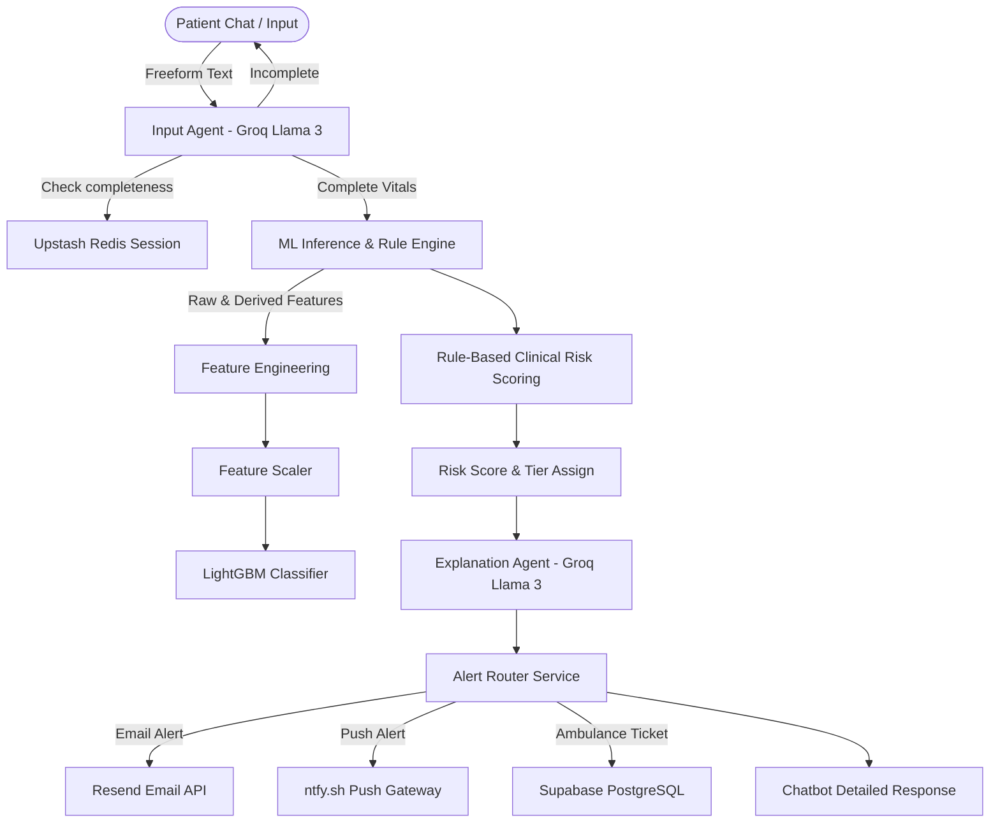

# VitalWatch: Post-Discharge Vital Monitoring & AI-Powered Alert System

VitalWatch is an AI-powered, clinician-first clinical telemetry and patient monitoring platform. It is designed to track post-discharge patients, run clinical rule engines and machine learning classifiers to assess patient risk tiers, generate clinical explanations, and automate urgent medical notifications (via Email, Push, and EMS Ambulance Tickets).

---

## Key Features

- **Multi-Agent AI Pipeline (Groq + Llama 3)**:
  - **Input Agent**: Extracts vital signs from patient-reported free-form text or logs using conversational state tracking persisted in Redis. Supports multi-turn patient inputs if some parameters are missing.
  - **Explanation Agent**: Generates clinician-friendly, structured explanations for calculated risk scores and abnormal readings.
- **Machine Learning Inference**:
  - **Continuous Risk Regression**: Uses an **XGBoost Regressor** (R² = 0.998) to calculate patient risk index.
  - **Confidence Classification**: Uses a **LightGBM Classifier** (Accuracy = 0.988) to categorize patients into `Good`, `Ambiguous`, and `Bad` risk classes.
- **Dynamic Feature Engineering**: Computes derived clinical metrics such as **Pulse Pressure**, **Shock Index**, **Oxygen Deficit**, **Heart Rate/Temp Ratio**, and running trends (rolling averages/historical trend metrics).
- **Automated Routing & Alerts**:
  - **NORMAL (Risk < 0.06)**: Safe state, silently logged.
  - **WARNING (0.06 <= Risk < 0.30)**: High-priority email alert sent to the doctor via **Resend**.
  - **CRITICAL (Risk >= 0.30)**: Doctor email (Resend) + Push notification to family (ntfy.sh) + Automatic dispatch ticket created for emergency ambulance services in **Supabase**.
- **Clinician Dashboard Integration**: Restful endpoints for patients database, alerts history, ambulance dispatch state, and doctor actions logs.

---

## Architecture & System Topology



---

## Tech Stack

- **Backend**: FastAPI (Python 3.10+)
- **LLM Engine**: Groq SDK (llama-3.3-70b-versatile)
- **State Store**: Upstash Redis (Serverless Redis)
- **Database**: Supabase (PostgreSQL client)
- **ML Models**: XGBoost, LightGBM, Joblib, Scikit-Learn
- **Notification Services**: Resend (Emails), ntfy.sh (Push Notifications)

---

## Project Structure

```
VitalWatch/
├── backend/
│   ├── agents/
│   │   ├── explanation_agent.py   # Groq-powered prediction explanation generator
│   │   └── input_agent.py         # Groq-powered unstructured vitals extractor
│   ├── db/
│   │   ├── redis_client.py        # Redis session management
│   │   └── supabase_client.py     # Supabase DB operations (Readings, Alerts, Tickets)
│   ├── models/
│   │   ├── feature_names.pkl      # Saved feature names list
│   │   ├── label_encoder.pkl      # Scikit-learn Label Encoder
│   │   ├── lgbm_classifier.pkl    # LightGBM Classifier model
│   │   ├── metadata.json          # Model metadata (accuracy, thresholds)
│   │   ├── scaler.pkl             # Feature scaler model
│   │   └── xgb_regressor.pkl      # XGBoost Regressor model
│   ├── routers/
│   │   ├── alerts.py              # Active/historical alert endpoints
│   │   ├── input.py               # Input agent test endpoint
│   │   ├── patients.py            # Patient CRUD & trends endpoints
│   │   ├── predict.py             # Inference pipeline endpoints
│   │   └── tickets.py             # Ambulance/emergency ticket endpoints
│   ├── services/
│   │   ├── alert_service.py       # Alert routing logic
│   │   ├── feature_engineering.py  # Feature calculation pipeline
│   │   ├── inference.py           # Model loading & predictions manager
│   │   └── risk_rules.py          # Clinical rules risk logic
│   ├── .env                       # Environment variables config (ignored)
│   ├── config.py                  # Pydantic settings schema
│   ├── main.py                    # App starter and CORS config
│   ├── requirements.txt           # App dependencies
│   └── schemas.py                 # Pydantic models for request/response validation
├── .gitignore                     # Git ignore rules
├── run.sh                         # Workspace setup helper script
└── README.md                      # Platform documentation
```

---

## Installation & Setup

### 1. Prerequisites
- Python 3.10 or 3.11
- Git

### 2. Setup Environment
Clone the repository and initialize a virtual environment:
```bash
# Navigate to project
cd VitalWatch

# Create virtual environment
python -m venv venv

# Activate virtual environment
# On Windows:
venv\Scripts\activate
# On Linux/macOS:
source venv/bin/activate

# Install dependencies
pip install -r backend/requirements.txt
```

### 3. Environment Configuration
Create a `.env` file in the `backend/` directory and configure the following parameters:
```env
# Groq
GROQ_API_KEY=your-groq-api-key
GROQ_MODEL=llama-3.3-70b-versatile

# Supabase
SUPABASE_URL=your-supabase-url
SUPABASE_KEY=your-supabase-anon-key
SUPABASE_SERVICE_ROLE_KEY=your-supabase-service-key

# Upstash Redis
UPSTASH_REDIS_REST_URL=your-upstash-redis-rest-url
UPSTASH_REDIS_REST_TOKEN=your-upstash-redis-rest-token

# Alerts
RESEND_API_KEY=your-resend-api-key
ALERT_EMAIL_FROM=alerts@resend.dev
NTFY_TOPIC=vitalwatch-alerts

# Risk Thresholds
RISK_CRITICAL_THRESHOLD=0.30
RISK_WARNING_THRESHOLD=0.06
```

### 4. Running the Application
From the `backend/` directory, launch the Uvicorn server:
```bash
cd backend
uvicorn main:app --host 0.0.0.0 --port 8000 --reload
```
Once started:
- Interactive Swagger docs will be available at http://localhost:8000/docs
- Alternative documentation is available at http://localhost:8000/redoc

---

## Frontend Setup (Separate Dashboard Component)

The backend is built to pair with a frontend dashboard application (typically built using React, Vite, and TailwindCSS) running on port 5173:
- Configured via `FRONTEND_URL` in the `.env` file (defaults to `http://localhost:5173`).
- Provides a real-time clinician alerts panel, patient telemetry history graphs, and emergency ambulance ticketing tracking.
- Run commands:
  ```bash
  cd frontend
  npm install
  npm run dev
  ```

---

## API Documentation Summary

### 1. ML Inference Pipeline
* **POST `/api/predict`**: Direct prediction interface. Takes 10 raw parameters + history, returns risk assessment immediately.
* **POST `/api/predict/full`**: One-shot chatbot pipeline. Processes raw user message, parses vitals (with Redis session support), calculates risk, triggers notification alerts, writes to database, and responds.

### 2. Patients & Trends
* **POST `/api/patients`**: Create a patient registry.
* **GET `/api/patients`**: Retrieve list of all registered patients.
* **GET `/api/patients/{patient_id}`**: Get specific patient info.
* **GET `/api/patients/{patient_id}/readings`**: Get patient's historical vitals.
* **GET `/api/patients/{patient_id}/trend`**: Get 7-day risk, HR, SpO2 trend data (formatted for frontend charts).

### 3. Alerting & Emergency Dashboard
* **GET `/api/alerts/active`**: Retrieve unacknowledged medical alerts.
* **PUT `/api/alerts/{alert_id}/acknowledge`**: Let clinicians acknowledge alerts.
* **POST `/api/alerts/{alert_id}/action`**: Record clinical doctor action taken (e.g. increase monitoring, visit).
* **GET `/api/tickets/open`**: Retrieve open ambulance dispatch tickets.
* **PUT `/api/tickets/{ticket_id}/status`**: Update paramedic status (EN_ROUTE, ON_SCENE, RESOLVED).

---

## Feature Space & Validation

### Raw Vital Inputs Required
- **Systolic BP**: 60 - 250 mmHg
- **Diastolic BP**: 40 - 150 mmHg
- **Heart Rate**: 30 - 220 bpm
- **SpO2**: 70 - 100%
- **Body Temperature**: 34.0 - 42.0 °C
- **Respiratory Rate**: 5 - 60 breaths/min
- **ECG Amplitude**: 0.3 - 2.0 mV
- **Cardiac Output**: 1.0 - 15.0 L/min

### ML Model Performance
- XGBoost Regressor ($R^2$ Score): 0.9983
- LightGBM Classifier (Accuracy / F1 Score): 0.9885
